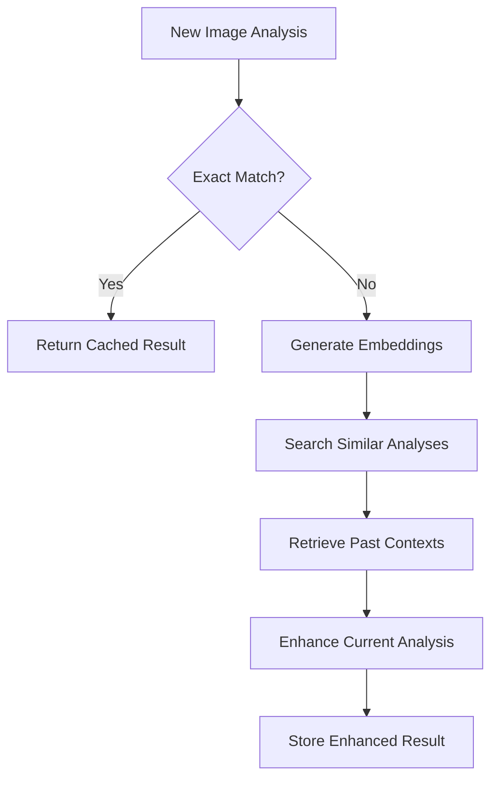

# Context Detective

Context Detective is an AI-powered application that analyzes images to determine their context, meaning, and significance. It uses a combination of visual analysis, style recognition, web search, and memory-enhanced inference to provide comprehensive insights about images.

## Features

- **Visual Elements Analysis**: Identifies objects, people, colors, and text in images
- **Style Analysis**: Recognizes artistic styles and cultural elements
- **Scenario Analysis**: Determines what might be happening in the image
- **Context Inference**: Provides a comprehensive analysis of the image's context
- **Confidence Rating**: Indicates how confident the system is in its analysis
- **Memory System**: Stores and retrieves analyses using vector-based similarity search
- **Exact Match Caching**: Instantly retrieves results for previously analyzed images

## Installation

1. Clone the repository:
   ```
   git clone https://github.com/yourusername/context-detective.git
   cd context-detective
   ```

2. Install the required dependencies:
   ```
   pip install -r requirements.txt
   ```

3. Create a `.env` file in the root directory with your API keys:
   ```
   GEMINI_API_KEY=your_gemini_api_key_here
   MEMORY_PATH=path/to/memory_storage  # Optional: defaults to "memory_storage"
   OLLAMA_URL=http://localhost:11434   # Optional: for vector embeddings
   ```

## Usage

1. Start the MCP server:
   ```
   python main.py
   ```

2. Start the Streamlit application:
   ```
   streamlit run app.py
   ```

3. Upload an image using the file uploader.

4. Click the "Analyze" button to start the analysis.

5. View the results, which include:
   - Context Guess
   - Confidence Rating
   - Explanation
   - Related Links
   - Search Terms Used

## How It Works

Context Detective uses a multi-step workflow to analyze images:

1. **Hash Computation**: Generates a unique hash for the image and checks for exact matches in memory
2. **Visual Elements Analysis**: Identifies objects, people, colors, and text in the image
3. **Style Analysis**: Recognizes artistic styles and cultural elements
4. **Scenario Analysis**: Determines what might be happening in the image
5. **Search Term Generation**: Creates effective search terms based on the analyses
6. **Web Search**: Gathers contextual information from the web
7. **Memory Retrieval**: Finds semantically similar past analyses using vector search
8. **Context Inference**: Combines all analyses and memory to determine the image's context
9. **Memory Storage**: Stores the complete analysis in vector database for future use

## Memory System Architecture

Context Detective implements a sophisticated multi-layered memory system that enhances image analysis through past experiences:

### 1. Memory Layers

#### Short-Term Memory
- **Purpose**: Caches intermediate analysis results during active sessions
- **Storage**: In-memory dictionary with session-based organization
- **Components Stored**:
  - Visual element analysis
  - Style analysis
  - Scenario analysis
  - Intermediate search results
- **Lifecycle**: Cleared after session completion or explicit cleanup

#### Long-Term Memory
- **File-Based Storage**:
  - Complete analysis results stored as JSON files
  - Indexed by image hash for exact matching
  - Includes full analysis context and metadata

- **Vector Storage (ChromaDB)**:
  - **Collections**:
    - `complete_analysis`: Full analysis results
    - `visual_elements`: Visual component analyses
    - `style_analysis`: Style and aesthetic analyses
    - `scenario_analysis`: Scenario interpretations
    - `inferred_contexts`: Memory-enhanced context inferences

### 2. Memory Operations

#### Retrieval Operations
1. **Exact Match Check**
   - Computes image hash
   - Checks for identical previous analysis
   - Returns complete cached result if found
   - Performance: O(1) lookup time

2. **Similar Analysis Retrieval**
   - Generates embeddings for current analysis
   - Performs semantic similarity search
   - Returns top-k similar past analyses
   - Used for context enhancement

3. **Memory-Enhanced Inference**
   - Combines current analysis with similar past experiences
   - Weights influence based on similarity scores
   - Enhances context understanding through past knowledge

#### Storage Operations
1. **Analysis Storage**
   - Stores complete analysis in file system
   - Updates hash index
   - Generates and stores embeddings
   - Creates separate collection entries for components

2. **Context Storage**
   - Stores inferred contexts with metadata
   - Records memory influence metrics
   - Maintains traceability of enhancement

### 3. Memory Enhancement Process



### 4. Memory Statistics and Monitoring

The system maintains comprehensive statistics about:
- Active sessions and components
- File storage utilization
- Vector collection sizes
- Retrieval success rates
- Memory enhancement metrics

### 5. Logging and Traceability

Each memory operation is extensively logged with:
- Operation boundaries (start/end)
- Duration measurements
- Success/failure status
- Detailed operation context
- Memory influence metrics
- Error traces when applicable

Example log structure:

## Architecture

The application consists of four main components:

1. **MCP Server** (`main.py`): Provides analysis tools and memory management
2. **Memory Module** (`modules/memory.py`): Handles storage and retrieval of analyses
3. **Streamlit UI** (`app.py`): Provides a user-friendly interface for uploading images and viewing results
4. **ChromaDB**: Vector database for semantic storage and retrieval of analyses

## License

This project is licensed under the MIT License - see the LICENSE file for details.

## Article
[Medium Write Up](https://medium.com/@sijpapi/embedding-memory-into-a-simple-ai-agent-a-practical-guide-with-fastapi-chromadb-and-ollama-7dd765567ac5)